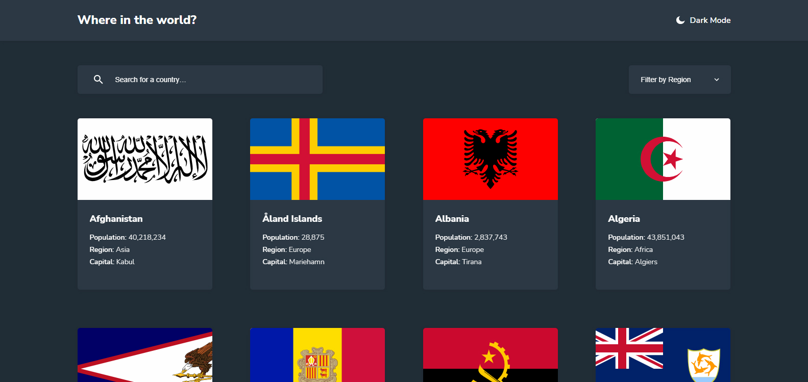

# Frontend Mentor - REST Countries API with color theme switcher solution

This is a solution to the [REST Countries API with color theme switcher challenge on Frontend Mentor](https://www.frontendmentor.io/challenges/rest-countries-api-with-color-theme-switcher-5cacc469fec04111f7b848ca). Frontend Mentor challenges help you improve your coding skills by building realistic projects.

## Table of contents

- [Overview](#overview)
  - [The challenge](#the-challenge)
  - [Screenshot](#screenshot)
  - [Links](#links)
- [My process](#my-process)
  - [Built with](#built-with)
  - [What I learned](#what-i-learned)
  - [Continued development](#continued-development)
  - [Useful resources](#useful-resources)
- [Author](#author)
- [Acknowledgments](#acknowledgments)

## Overview

### The challenge

Users should be able to:

- See all countries from the API on the homepage
- Search for a country using an `input` field
- Filter countries by region
- Click on a country to see more detailed information on a separate page
- Click through to the border countries on the detail page
- Toggle the color scheme between light and dark mode *(optional)*

### Screenshot

### Links

- Solution URL: [https://github.com/jpdrsanchez/typescript-rest-countries-api](https://github.com/jpdrsanchez/typescript-rest-countries-api)
- Live Site URL: [http://typescript-rest-countries-api.vercel.app/](http://typescript-rest-countries-api.vercel.app/)

## My process

### Built with

- Semantic HTML5 markup
- CSS custom properties
- Flexbox
- CSS Grid
- Mobile-first workflow
- [Typescript](https://www.typescriptlang.org/) - Syntactical superset of JavaScript
- [React](https://reactjs.org/) - JS library
- [Next.js](https://nextjs.org/) - React framework
- [Styled Components](https://styled-components.com/) - For styles
- [Axios](https://axios-http.com/) - Http Client
- [Jest](https://jestjs.io/) - Javascript Testing Framework
- [React Testing Library](https://testing-library.com/docs/react-testing-library/intro) - React Testing Utilities

### What I learned

In this project I could learn a lot about using `typescript` and learned a lot about `unit testing` with `jest` and `RTL`.

### Continued development

I want to continue focusing on the study of `unit tests` with `jest` and I also want to start studying `integration tests`.

### Useful resources

- [NextJS Docs](https://nextjs.org/docs/getting-started)
- [Styled Components Docs](https://styled-components.com/docs)
- [Typescript Handbook](https://www.typescriptlang.org/docs/handbook/intro.html)
- [Jest Docs](https://jestjs.io/docs/getting-started)
- [RTL Dosc](https://testing-library.com/docs/react-testing-library/intro)

## Author

- Website - [João Pedro Sanchez](https://github.com/jpdrsanchez)
- Frontend Mentor - [@jpdrsanchez](https://www.frontendmentor.io/profile/jpdrsanchez)
- Twitter - [@jpdrsanchez](https://twitter.com/jpdrsanchez)
- Linkedin - [jpdrsanchez](https://www.linkedin.com/in/jpdrsanchez/)
